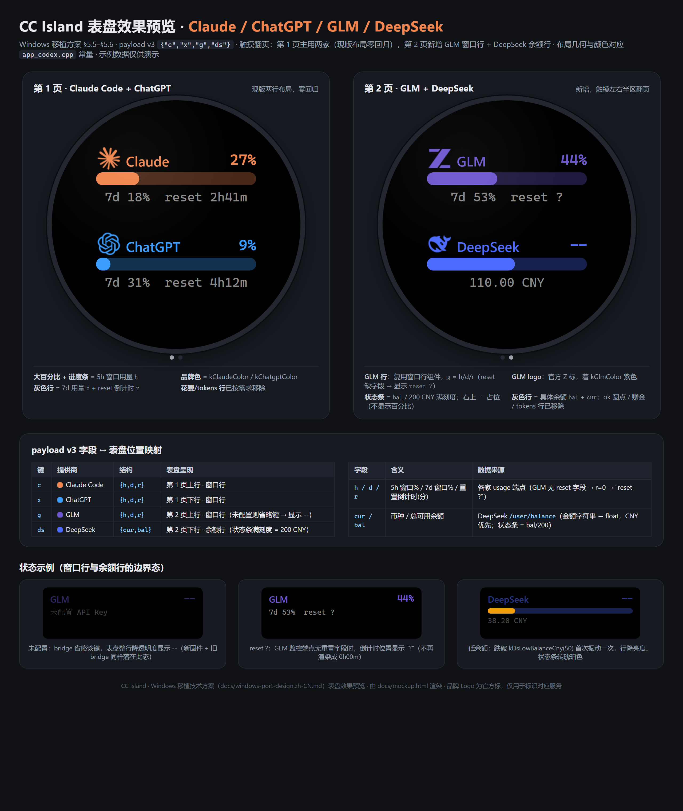

# cc-island Windows 移植技术方案

> 目标：把 cc-island 的 Mac 端 bridge（读取凭证 → 查官方用量接口 → 算本地日志花费 → BLE 推送）移植到 Windows，
> 数据仍然只在本机处理，通过蓝牙 BLE 把算好的数字推到 M5Stack StopWatch。
> 并在本次移植中**新增 GLM（智谱 bigmodel.cn）用量统计**与 **DeepSeek 余额查询**，表盘升级为
> Claude / ChatGPT / GLM / DeepSeek 四家（分两页显示，交互见 §5.5）。
> 手表固件仅做 UI 演进（新增第二页），BLE 协议向后兼容，刷新/按钮交互不变。

---

## 0. 最新修订（实现与本文草图不一致处，以本节为准）

1. **表盘字段精简**：三家窗口行的今日花费 `$` 与 tokens `t` 已移除，窗口行只含 `{h,d,r}`；
   DeepSeek 余额行的 `ok`（可用态圆点）、`gnt`（赠金）、`x_cur/x_bal`（第二币种）已移除，只含 `{cur,bal}`。
2. **Codex 更名 ChatGPT**：表盘行名、logo 资产（`logo_chatgpt.c`/`icon_chatgpt.c`）、bridge 数据键与渲染标题均已更名；
   BLE 线上键仍为 `"x"`（保持协议向后兼容），凭证仍读 OpenAI Codex CLI 的 `~/.codex/auth.json`。
3. **GLM logo 改紫色**：官方 Z 标着 `kGlmColor`（0x6E56CF），不再用官方白色。
4. **Claude/ChatGPT logo 换官方标**：源图 `tools/claude.png`、`tools/openai.png`（浏览器渲染官方 SVG 所得）。
5. **成本统计降级为诊断项**：本地日志花费扫描从主流程移除，保留 `_log_costs` 仅供 `--json` 查看，表盘不显示。
   本文中 §4.4/§5.2/§5.4 的成本/归因/ok-gnt 相关草图按此理解。
6. **专用 key 存放**：GLM/DeepSeek key 存 `~/.cc-island/config.json`（字段 `glm_key`/`deepseek_key`，
   可选 `glm_endpoint`/`ds_endpoint` 覆盖端点）。发现顺序更新为：CLI → 专用配置文件 → 通用环境变量
   → `settings.json` → `config.toml`（见 §4.2）。
7. **App 图标**：launcher 图标换成 clover 标（`tools/clover.svg` → `clover.png`，着绿色），资产更名
   `icon_ccisland.c`（原四标拼接 `icon_chatgpt.c` 弃用）。
8. **亮度**：进入 app 时重读系统设置亮度并重新应用（`getBackLightBrightness(true)` + 重设），保证与系统设置一致。

---

## 1. 现状架构分析（移植前的盘点）

cc-island 的运行时分为两半：

```
  主机端（要移植/扩展的部分）                      手表端（仅加第二页 UI）
  ─────────────────────────────                 ──────────────────────────────────
  bridge/codexisland_bridge.py                  firmware/app_codex
   · 读 ~/.codex/auth.json          ┐            · NimBLE Nordic-UART-Service 外设
   · 读 Claude 凭证（Keychain）      ├ 数据面      · 解析 JSON，画上下两行（LVGL）
   · 调各家官方用量接口              │            · 蓝键(G1) → TX notify "R" 请求刷新
   · 从 ~/.claude、~/.codex 日志算钱 ┘            · 过阈值(80%)振动
   · bleak 扫描/连接/写 RX 特征值    ─ BLE 推送 ─▶ · 每次开机后需手动打开一次 app 开始广播
```

对 `codexisland_bridge.py`（约 670 行）逐段做平台相关性判定：

| 模块 | 函数/代码段 | Windows 相关性 | 结论 |
|---|---|---|---|
| HTTP 层 | `_http`、`_SSL_CTX`（urllib + certifi） | 无。Windows 上 `ssl.create_default_context()` 自动加载系统证书库，certifi 逻辑可原样保留 | ✅ 直接复用 |
| Codex 用量 | `fetch_codex`（读 `~/.codex/auth.json` → `chatgpt.com/backend-api/wham/usage`） | 无。Codex CLI 跨平台均用 `~/.codex/auth.json`，`expanduser` 在 Windows 映射到 `%USERPROFILE%` | ✅ 直接复用 |
| Claude 用量 | `_read_claude_creds` / `_write_claude_creds` / `_security`（调 `/usr/bin/security` 读钥匙串） | **强相关**。Mac 专用 Keychain 机制，Windows 上 Claude Code 把 OAuth 凭证存在 `%USERPROFILE%\.claude\.credentials.json` | 🔧 必须替换（核心改动） |
| Claude 刷新链路 | `_refresh_claude`（OAuth refresh token 换新 + 写回）、`_probe_claude`（usage 接口 + 401/403/429 处理） | 无。纯 HTTP 逻辑 | ✅ 直接复用（写回落点改为文件） |
| 成本统计 | `cost_claude` / `cost_codex`（glob 扫 `~/.claude/projects/**/*.jsonl`、`~/.codex/sessions/**/rollout-*.jsonl` + `_PRICING` 表） | 无。路径与日志格式跨平台一致；仅需兜住 Windows 文件占用（代码已按文件 try/except OSError） | ✅ 直接复用（按模型名归因，见 §4.4 / §5.4） |
| BLE 推送 | `ble_loop`（bleak 扫描/连接/start_notify/write_gatt_char、断线重连、5s 防抖、6h 旧数据兜底） | 无。**bleak 本身就是跨平台库，Windows 后端基于 WinRT**，这段代码可原样运行 | ✅ 直接复用（注意版本矩阵，见 §6.1） |
| 输出 | `render`（含 `█`、`⚠` 等字符） | 相关。中文 Windows 控制台默认 GBK，`print` 会抛 `UnicodeEncodeError` | 🔧 需加 UTF-8 兜底 |
| 部署 | `scripts/setup_autostart.sh`（LaunchAgent） | **强相关**。macOS 专属 | 🔧 换成任务计划程序 |

**结论：真正与平台绑定的只有 4 处 —— Claude 凭证存取、自启动脚本、控制台编码、bleak 版本选择。** 其余 90% 代码（含全部 BLE 交互逻辑）可原样复用。GLM 与 DeepSeek 为纯新增 provider（不改既有代码路径），分别见 §4、§5。

### 为什么不换别的技术路线

- **WSL2**：不支持蓝牙硬件直通，BLE central 无法在 WSL 内实现，必须原生 Windows Python。❌
- **.NET / WinRT 原生程序**：bleak 已经封装了 WinRT（`windows.devices.bluetooth`），重写无收益。❌
- **改用 Wi-Fi/串口传输**：偏离"同样通过蓝牙传输"的需求，且固件要改。❌

---

## 2. 移植后总体架构（Claude + ChatGPT + GLM + DeepSeek 四家）

```
  Windows（大脑）                                StopWatch / CC Island app（分页四行版）
  ─────────────────────────────────             ─────────────────────────────────────
  bridge/codexisland_bridge.py（跨平台单文件）
   · 读 %USERPROFILE%\.codex\auth.json
   · 读 %USERPROFILE%\.claude\.credentials.json   ← 替换 Keychain
   · 发现 GLM / DeepSeek API Key                  ← 新增（通用 key 扫描器，§4.2/§5.2）
     (env / settings.json / config.toml)
   · 调四家接口（成本统计降级为 --json 诊断项）
   · bleak(WinRT) 扫描 "CC Island"/NUS UUID
   · 每隔 N 分钟 / 收到 "R" notify 时推 payload v3：
     {"c":{...}, "x":{...}, "g":{...}, "ds":{...}} ──BLE(NUS)──▶ RX write → 解析 → 刷分页 UI
  部署：任务计划程序（登录触发 + 崩溃自动重启）
```

表盘最终效果（两页四行、字段落位、边界状态）见 §5.6 预览图与 `docs/watchface-preview.png`。

四家的数据源与机制对照（DeepSeek 是**按量计费 + 余额制**，没有 5h/7d 窗口，表盘行渲染模式不同）：

| | Claude Code | ChatGPT | GLM（bigmodel.cn） | DeepSeek |
|---|---|---|---|---|
| 用量/余额来源 | `api.anthropic.com/api/oauth/usage` | `chatgpt.com/backend-api/wham/usage` | `open.bigmodel.cn/api/monitor/usage/quota/limit`（非官方文档端点） | `api.deepseek.com/user/balance`（**官方文档端点**） |
| 凭证 | OAuth（`.credentials.json`，可 refresh） | `~/.codex/auth.json` access_token | API Key（env / settings.json / config.toml） | API Key（env / settings.json / config.toml） |
| 认证头 | `Bearer <oauth token>` | `Bearer <access_token>` | `<key>`（无前缀，401 退避 Bearer） | `Bearer <key>`（官方标准） |
| 5h/7d 窗口 | `five_hour` / `seven_day` | `primary_window` / `secondary_window` | `limits[]` 两个 `TOKENS_LIMIT` | 无（`is_available` + 余额） |
| 今日花费/tokens | **已移除**（表盘不显示，日志统计仅 `--json` 诊断） | 〃 | 〃 | 〃 |
| 表盘行类型 | 窗口行 | 窗口行 | 窗口行 | **余额行**（大字余额；赠金/可用态已移除） |

协议侧：payload 沿 `v1 → v2(+g) → v3(+ds)` 增量演进，**每一步向后兼容**（见 §4.5、§5.5）；NUS 三个 UUID、设备名 `CC Island`、刷新策略（定时 5 分钟 + 蓝键即时 + 5s 防抖 + 6h 旧数据兜底）全部不变。

---

## 3. 核心改动一：Claude 凭证存取（Keychain → 文件）

### 3.1 事实依据

Claude Code 官方文档（Authentication）明确：macOS 用加密钥匙串（服务名 `Claude Code-credentials`）；
**Windows/Linux 存于 `%USERPROFILE%\.claude\.credentials.json`**，内容是同一个 JSON 结构：

```json
{
  "claudeAiOauth": {
    "accessToken": "...",
    "refreshToken": "...",
    "expiresAt": 1757000000000,
    "scopes": ["user:inference", "user:profile"]
  }
}
```

（Windows 上仅插件/API key 类凭据走 Windows 凭据管理器；OAuth 凭证就是这个文件。）

### 3.2 设计：把 keychain 分支改为"按平台分流"

在单文件 bridge 内加两个平台分支函数，函数签名与现有一致，调用方 `fetch_claude` 完全不动：

```python
CRED_FILE = os.path.join(os.path.expanduser("~"), ".claude", ".credentials.json")

def _read_claude_creds():
    """返回 {account, oauth, _outer} 或 None。account 仅 macOS 有意义。"""
    if sys.platform == "darwin":
        return _read_claude_creds_keychain()          # 现有实现原样搬入
    # Windows / Linux：直接读文件（被占用时 OSError 已由上层容忍）
    try:
        with open(CRED_FILE, encoding="utf-8") as f:
            outer = json.load(f)
        oauth = outer.get("claudeAiOauth") or {}
    except (OSError, json.JSONDecodeError):
        return None
    if not oauth.get("accessToken") or not oauth.get("refreshToken"):
        return None
    return {"account": None, "oauth": oauth, "_outer": outer}

def _write_claude_creds(account, oauth):
    """token 轮换后写回，保证 Claude Code 自己不受影响。"""
    if sys.platform == "darwin":
        return _write_claude_creds_keychain(account, oauth)   # 现有实现
    # 读-改-写整个文件，保留 claudeAiOauth 以外的顶层键（如未来新增字段）
    outer = {}
    try:
        with open(CRED_FILE, encoding="utf-8") as f:
            outer = json.load(f)
    except (OSError, json.JSONDecodeError):
        pass
    outer["claudeAiOauth"] = oauth
    tmp = CRED_FILE + ".tmp"
    try:
        with open(tmp, "w", encoding="utf-8") as f:
            json.dump(outer, f)
        os.replace(tmp, CRED_FILE)      # 原子替换，避免半写状态
        return True
    except OSError:
        return False
```

要点：

1. **写回仍然必要**：`_refresh_claude` 的 refresh token 轮换逻辑是给 Claude Code 用的，Windows 上同样要把新 token 写回文件，否则下次 Claude Code 启动会因 token 失效要求重新 `/login`。
2. **原子替换**（temp + `os.replace`）：Windows 上 `os.replace` 是原子操作；同时降低与正在运行的 Claude Code 之间的写冲突窗口。残余竞争（bridge 与 CC 同时轮换）概率极低，且 CC 下次刷新会自行恢复，可接受——与 Mac 版用 `security -U` 覆盖写的风险等级一致。
3. **读文件被占用**：Claude Code 运行中持有 jsonl/credentials 文件时，Windows 可能抛 `PermissionError`（是 `OSError` 子类），现有按文件 try/except 已覆盖；表现为该次统计少算/凭证读取失败进入重试，不崩溃。
4. 环境变量 `CLAUDE_CODE_OAUTH_TOKEN` 探测链路（优先级 1）是纯平台无关逻辑，原样保留。

---

## 4. 核心改动二：新增 GLM（智谱 bigmodel.cn）用量统计

### 4.1 用量端点与响应结构（已核实的社区事实）

GLM Coding Plan（个人版）采用与 Claude/Codex 相同的 **每 5 小时限额 + 每周限额** 机制，官方控制台"用量统计"页可见；官方还发布了 Claude Code 内查询用的 `glm-plan-usage` 插件（`zai-org/zai-coding-plugins`），说明该数据有稳定的程序化入口。社区脚本（cc-switch #1588、pi-usage-bars 插件）使用的端点：

```
GET https://open.bigmodel.cn/api/monitor/usage/quota/limit      # 国内版 bigmodel.cn
GET https://api.z.ai/api/monitor/usage/quota/limit             # 国际版 z.ai
Authorization: <API_KEY>          # 注意：社区脚本直接放 key，无 "Bearer " 前缀
```

响应结构（cc-switch #1588 示例，实现时以实测为准）：

```json
{
  "code": 200, "msg": "操作成功", "success": true,
  "data": {
    "level": "pro",
    "limits": [
      {"type": "TIME_LIMIT",  "percentage": 7,  "usage": 1000, "currentValue": 72, "remaining": 928},
      {"type": "TOKENS_LIMIT", "percentage": 44},
      {"type": "TOKENS_LIMIT", "percentage": 53}
    ]
  }
}
```

解析规则设计：

- **5h / weekly**：取两个 `TOKENS_LIMIT` 条目的 `percentage`，第一个为 5 小时窗口、第二个为每周窗口；若条目含 `nextResetTime` 字段，则以"重置更早者为 5h 窗口"做二次校验（社区脚本即按此区分，示例响应未含该字段——实现时先按序取，实测再定）。
- **reset 倒计时**：无可靠字段则 `r=0`；固件端对无 reset 数据的行显示 `reset ?`（随 §5.5 UI 一并处理）。
- **plan**：`data.level`（lite/pro/max…）。
- **认证**：先按无前缀 `Authorization: <key>` 发送，若 401 再退避 `Bearer <key>` 重试一次，兼容两种行为。
- 该端点**未写入官方 API 文档**，属"社区事实"：代码里把 host（`open.bigmodel.cn` / `api.z.ai`）和路径做成常量 + `--glm-endpoint` 覆盖参数，失效时可快速切换。刷新间隔沿用默认 5 分钟，不对监控接口加压。

### 4.2 GLM / DeepSeek API Key 的本地发现（通用扫描器）

GLM 与 DeepSeek 的 key 落盘模式相同（用户把 Claude Code / Codex 路由到对应服务商，key 写在 settings.json 或 config.toml），因此做成**一个通用发现函数 + 各家 URL 匹配器**，而不是两套代码：

```python
# 每个 provider 一组：显式 env 名、URL 特征串、settings.json 里的 token 变量名
_KEY_MATCHERS = {
    "glm": {"envs": ("GLM_API_KEY", "ZAI_API_KEY", "ZHIPUAI_API_KEY"),
            "urls": ("bigmodel.cn", "z.ai"),
            "anthropic_vars": ("ANTHROPIC_AUTH_TOKEN", "ANTHROPIC_API_KEY")},
    "deepseek": {"envs": ("DEEPSEEK_API_KEY", "DEEPSEEK_KEY"),
                 "urls": ("deepseek.com",),
                 "anthropic_vars": ("ANTHROPIC_API_KEY", "ANTHROPIC_AUTH_TOKEN")},
}

def discover_key(name):
    """按 0-3 级顺序发现 key，返回 (key, base_hint) 或 (None, None)。"""
```

发现顺序（两家一致，命中即止）：

| 优先级 | 来源 | 说明 |
|---|---|---|
| 0 | `--glm-key` / `--deepseek-key` CLI 参数 | 显式指定，最高优先 |
| 1 | **专用配置文件 `%USERPROFILE%\.cc-island\config.json`** | 字段 `glm_key` / `deepseek_key`（推荐存放处）；`glm_endpoint` / `ds_endpoint` 可覆盖端点 |
| 2 | 通用 env：`CCISLAND_GLM_KEY`/`GLM_API_KEY`/`ZAI_API_KEY`/`ZHIPUAI_API_KEY`；`CCISLAND_DEEPSEEK_KEY`/`DEEPSEEK_API_KEY` | 环境变量（含 CLI 注入） |
| 3 | `%USERPROFILE%\.claude\settings.json` → `env` 块 | 用户用 **Claude Code 走该服务商** 的标准配置：`env.ANTHROPIC_BASE_URL` 含匹配串时，取 `ANTHROPIC_AUTH_TOKEN` 或 `ANTHROPIC_API_KEY`（GLM 官方：`https://open.bigmodel.cn/api/anthropic`；DeepSeek 官方：`https://api.deepseek.com/anthropic`） |
| 4 | `%USERPROFILE%\.codex\config.toml` → `[model_providers.*]` | 用户用 **Codex 走该服务商** 的配置：`base_url` 含匹配串的 provider 段，取 `experimental_bearer_token`；若是 `env_key = "XXX"` 则回退读该环境变量（GLM 官方 Codex 配置即此形态） |
| — | 全部未命中 | 视为"未配置"：payload 省略对应键，表盘该行显示 `--` |

发现函数同时返回 `base_hint`（命中来源里的 base_url，用于选国内/国际端点，如 GLM），可被 `--glm-endpoint` 强制覆盖。TOML 解析用 Python 3.11+ 标准库 `tomllib`（只读，不回写）。

安全边界与 Mac 版一致：**key 只在本机使用，绝不上表、不写日志**（日志里出现 key 的路径全部打码）。

### 4.3 `fetch_glm()` 数据面实现

```python
GLM_MONITOR_USAGE = "https://open.bigmodel.cn/api/monitor/usage/quota/limit"

def fetch_glm():
    key, base = _glm_creds()                     # 缓存发现结果，key 不变则不重扫
    if not key:
        return {"error": "not configured"}       # compact() 据此省略 "g"
    status, obj = _http("GET", _glm_endpoint(base), headers={"Authorization": key})
    if status == 401 and _glm_sent_bare:
        status, obj = _http(..., headers={"Authorization": f"Bearer {key}"})   # §4.1 退避
    if status != 200 or not (obj or {}).get("success"):
        return {"error": f"http {status} {obj.get('msg', '') if isinstance(obj, dict) else ''}"}
    d = obj.get("data") or {}
    limits = d.get("limits") or []
    tokens = [x for x in limits if x.get("type") == "TOKENS_LIMIT"]
    five = (tokens or [{}])[0].get("percentage", 0)
    week = (tokens[1] if len(tokens) > 1 else {}).get("percentage", 0)
    return {
        "plan": d.get("level"),
        "five_hour": _window(five, None),      # reset 字段缺失时为 None → r=0
        "weekly": _window(week, None),
    }
```

复用现有 `_window()` 归一化与 `remember_good`/`with_cached_windows` 的 6 小时旧数据兜底：把 `("claude", "codex")` 两处循环扩成 `("claude", "codex", "glm", "deepseek")`，任一家网络失败时表盘显示最近一次有效数据（带 stale 语义）。

### 4.4 成本与 token 归因（按模型名分流）

用户走 GLM/DeepSeek 时，会话日志仍落在 `~/.claude/projects/**/*.jsonl` 或 `~/.codex/sessions/**/rollout-*.jsonl`，只是 `model` 字段变成 `glm-*` / `deepseek-*`。现有 `cost_claude`/`cost_codex` 把全部 token 记到各自行，需要改成**按模型名归因**：

```python
def _owner_of(model):
    m = _canonical_model(model or "")
    if m.startswith("glm"):      return "glm"
    if m.startswith("deepseek"): return "ds"
    if m.startswith("gpt"):      return "codex"    # OpenAI
    return "claude"                                # claude-* 及未识别模型默认归 Claude
```

- 两个解析函数的累计器从 `(cost, tokens)` 改为按 owner 分桶，`collect()` 汇总到 `data[owner]["cost_today"]/["tokens_today"]`。
- **GLM 花费默认计 0**：Coding Plan 是订阅制，按 token 折价会失真；`_PRICING` 增加 GLM 段位（CNY/百万 token，含 `CNY_PER_USD` 汇率常量）作为**可选配置**，用户想看折算价时自行按[官方价格页](https://open.bigmodel.cn/pricing)填入——文档不预填未经核实的数字。
- **DeepSeek 是按量计费**，理论上可算真实花费；同样把价格段位做成可选配置（按[官方定价](https://api-docs.deepseek.com/zh-cn/quick_start/pricing)自填），默认 0、只显示余额与 tokens。
- 行为不变性：纯 Claude/Codex 用户（无 glm/deepseek 会话）归因结果与现版本完全一致。
- 已知限制：若服务商的 Anthropic 兼容层在响应里回显请求模型名（`claude-*`）而非实际模型名，日志将无法归因到 GLM/DeepSeek——实现时看一眼本地日志的 `model` 字段即可确认，属可接受的精度损失。

### 4.5 payload v2（向后兼容的协议增量）

```json
{"c":{"h":12,"d":34,"r":123},
 "x":{"h":5,"d":8,"r":42},
 "g":{"h":44,"d":53,"r":0}}
```

- `compact()` 在 `data["glm"]` 无 error 时追加 `"g"`；未配置/查失败且无缓存时**整个键省略**，不推零值。
- 兼容矩阵：
  - 旧固件 + 新 bridge：cJSON 解析遇到未知键会被忽略（`cJSON_GetObjectItem` 返回 NULL，`update_from_json` 判 `cJSON_IsObject` 直接 false），**不会崩**，只是新行保持占位。
  - 新固件 + 旧 bridge：键缺失 → 对应行显示 `--`（未配置态）。
- payload v2 约 160 字节（v3 约 200 字节，见 §5.5），仍在 GATT 写舒适区内（MTU 协商 ≥ 185，超出部分走长写，见 §6.3）。

---

## 5. 核心改动三：新增 DeepSeek 余额查询

DeepSeek 与前三家模式不同：**按量计费、查询账户余额**，没有用量窗口。端点与响应为官方文档化接口，稳定性高于 GLM 的社区端点。

### 5.1 端点与响应结构（官方文档，已核实）

依据 [DeepSeek 官方文档·查询账户余额](https://api-docs.deepseek.com/zh-cn/api/get-user-balance)：

```
GET https://api.deepseek.com/user/balance
Authorization: Bearer <API_KEY>        # 官方标准 Bearer 认证（见首次调用文档）
```

响应（200，**金额均为字符串**）：

```json
{
  "is_available": true,
  "balance_infos": [
    {
      "currency": "CNY",
      "total_balance": "110.00",
      "granted_balance": "10.00",
      "topped_up_balance": "100.00"
    }
  ]
}
```

解析规则设计：

- **余额取值**：`balance_infos` 是数组（多币种账户可能 CNY/USD 各一条）。取币种优先级 `CNY > USD`（国内账户主币种；两条并存时把另一条并入 detail 行），金额 `float(total_balance)`。
- **可用态**：`is_available == false`（余额耗尽/欠费）时该行降亮度显示，配合 §5.5 的低余额提醒。
- **错误处理**：401 → `error: "invalid api key"`；其余非 200 → `error: "http N"`，走 6h 旧数据兜底。官方未对该端点公布限流（仅模型接口有"限速与隔离"页），5 分钟轮询无压力，也不消耗模型额度。
- key 来源按 §4.2 通用发现（DeepSeek 匹配器）；全部未命中则 payload 省略 `"ds"`。

### 5.2 `fetch_deepseek()` 数据面实现

```python
DS_BALANCE_URL = "https://api.deepseek.com/user/balance"

def fetch_deepseek():
    key, _ = _ds_creds()
    if not key:
        return {"error": "not configured"}
    status, obj = _http("GET", DS_BALANCE_URL, headers={"Authorization": f"Bearer {key}"})
    if status != 200 or not isinstance(obj, dict) or "balance_infos" not in obj:
        return {"error": f"http {status}"}
    infos = obj["balance_infos"] or []
    if not infos:
        return {"error": "no balance info"}
    infos.sort(key=lambda x: 0 if x.get("currency") == "CNY" else 1)   # CNY 优先
    main, extra = infos[0], (infos[1] if len(infos) > 1 else None)
    return {
        "ok": bool(obj.get("is_available")),
        "currency": main.get("currency", "CNY"),
        "balance": float(main.get("total_balance") or 0),        # 字符串金额，注意容错
        "granted": float(main.get("granted_balance") or 0),
        "extra": ({"currency": extra["currency"], "balance": float(extra["total_balance"])}
                  if extra else None),
    }
```

### 5.3 低余额提醒

与现有"80% 上穿振动"对偶：firmware 常量 `kDsLowBalanceCny = 50.0`（可调），余额从上方首次跌破阈值时振动一次（用与 `last_p5h` 相同的"上次值"哨兵机制防重复提醒）。`is_available` 从 true 翻 false 视同跌破。

### 5.4 今日 token 归因

按 §4.4 的 `_owner_of`：`deepseek-*` 模型（`deepseek-chat`、`deepseek-reasoner`、经 Anthropic 层映射的 `deepseek-v4-pro/flash`）记入 `ds` 行 tokens。已知限制：走 Claude Code 路由时若响应回显 `claude-*` 模型名，则日志无法归因到 DeepSeek（§4.4 已述）。

### 5.5 payload v3 与固件第二页（余额行渲染）

**payload 增量**（在 v2 基础上追加，依旧向后兼容——旧固件忽略未知键）：

```json
{"c":{...}, "x":{...}, "g":{...},
 "ds":{"cur":"CNY", "bal":110.00}}
```

- `bal` 跌破固件阈值时触发 §5.3 提醒；`ok`/`gnt`/`x_cur/x_bal` 随功能精简移除。
- 余额行与窗口行的数据形状不同（无 h/d/r），固件解析分支按键区分。

**固件 UI 方案**（与 §4 的 GLM 行合并考虑，两行新增内容一起放）：

| 方案 | 做法 | 优点 | 缺点 | 结论 |
|---|---|---|---|---|
| A. 四行单页 | 466×466 圆屏塞 4 行（行高 ~64px，y=±52/±156，字号 16–20） | 无新交互 | 圆屏上下边缘弦宽仅 ~340px，字号过小，可读性差 | 备选 |
| **B. 触摸翻页（推荐）** | 保持现有两行布局原样作为**第 1 页**（Claude/ChatGPT，零回归）；新增**第 2 页**两行：GLM（窗口行，复用 `build_row`）+ DeepSeek（余额行）；触摸屏幕左/右半区翻页，`onRunning` 处理 `LV_EVENT_CLICK` 判触点 x | 两行布局与字号完全不动，回归风险最小；分页语义清晰（第 1 页主用、第 2 页扩展）；触摸屏硬件现成 | GLM/DS 需翻页才可见 | ✅ 推荐 |

方案 B 细节：

- **两页最终渲染效果见 §5.6 预览图**（`docs/watchface-preview.png`，由 `docs/mockup.html` 出图）。

- 第 2 页 GLM 行直接复用现有 `build_row`/`ProviderRow`；DeepSeek 行为新增的余额行类型：大字位置显示 `¥110.00`（按 `cur` 映射符号：CNY→`¥`，USD→`$`），行仅保留余额大字（赠金行与 ok 圆点已随功能精简移除）。
- 页面状态用 `static int s_page` 持久（app 关闭重开后停在原页，符合"瞄一眼"的使用习惯）。
- 蓝键刷新、双键回主页、80%/低余额振动逻辑不变；logo 新增 `logo_glm.c` 与 `logo_deepseek.c`，均采用**官方标**：GLM 为官方白色 Z 标（`tools/glm.png`，带 alpha——黑色表盘上按官方暗底处理原样显示白色，行文字仍用 `kGlmColor`），DeepSeek 为官方 favicon 鲸鱼（`tools/deepseek.svg` → 渲染为 `tools/deepseek.png`）。`gen_icons.py` 生成：glm/deepseek 源为 PNG，走免依赖的 `png_to_logo.py`（alpha/暗度两种 coverage 规则 + 等比 fit）；claude/codex 源为 SVG，走 svglib 管线。商标声明同现有条目。
- `app_codex.cpp` 改动集中在：页容器 ×2、触摸事件、`parse_and_apply` 里按 `"c"/"x"/"g"/"ds"` 四键分发 + 余额行 apply 函数。`ble_nus.cpp/h` 依旧零改动。

### 5.6 表盘效果预览（四提供商）



上图按 `app_codex.cpp` 的真实布局参数渲染（466×466 圆屏、行容器 300×140、行垂直中心 y=±80、进度条 300×24、字号 26/28/24、品牌色取 `kClaudeColor/kChatgptColor/kGlmColor/kDeepseekColor`）：

- **第 1 页**：Claude / ChatGPT 窗口行（无花费/tokens 行）——布局与现版一致。
- **第 2 页**：GLM 窗口行（含 `reset ?` 边界态，官方 Z 标着紫色）+ DeepSeek 余额行（大字余额 `¥110.00`，无进度条；ok 圆点/赠金/tokens 行已移除）。
- **状态示例卡**：未配置（`--`、整行降透明度）、`reset ?`、低余额（跌破 `kDsLowBalanceCny` 首次振动、数字转琥珀色）——对应 §9.3 测试项 8。
- 图例部分给出 payload v3 各键 ↔ 表盘位置的映射，可直接作为联调时的对照表。

调整 `app_codex.cpp` 的颜色/布局常量后，同步修改 `docs/mockup.html` 再出图：

```
"C:\Program Files (x86)\Microsoft\Edge\Application\msedge.exe" --headless=new --disable-gpu ^
  --force-device-scale-factor=2 --window-size=1280,1520 ^
  --screenshot=docs\watchface-preview.png "file:///<repo>/docs/mockup.html"
```

---

## 6. 核心改动四：BLE 层在 Windows 上的运行要点

`ble_loop` 的逻辑不用改，但 bleak 的 Windows 后端（WinRT / `windows.devices.bluetooth`）有几个必须写进方案的差异点：

### 6.1 版本矩阵（重要）

bleak 新版本（1.x 起）随 `winrt` 2.x 包把最低系统要求提高到了 **Windows 11 build 22000+**；支持 Windows 10 的是 0.22.x 及以下（依赖 `bleak-winrt`）：

| 目标系统 | 安装要求 |
|---|---|
| Windows 11 (22000+) | `pip install -U bleak`（最新版即可） |
| Windows 10（16299–19045） | `pip install "bleak==0.22.*"`（锁在 0.22.x，用 bleak-winrt） |

`setup_autostart.ps1` 里按 `[Environment]::OSVersion.Version.Build` 自动选择，或直接统一锁 `bleak==0.22.3`（Mac/Win 通用，代价是 Win11 上用不到新修复）。**推荐：脚本检测 build ≥ 22000 装最新版，否则锁 0.22.x。**

其余环境要求：64 位 python.org CPython 3.11+（不建议 Microsoft Store 版 Python，pywinrt 历史上在其上有 DLL 加载问题；3.11+ 也保证 `tomllib` 可用）；蓝牙 radio 开启；`Bluetooth Support Service` 未被禁用。

### 6.2 扫描与匹配

- Windows 端与 Mac 相同：按 `设备名 == "CC Island"` 或 `广播服务 UUID 含 NUS` 匹配（`find_device_by_filter`）。WinRT 的广告监听会报告 128-bit 服务 UUID，两种匹配都可用。
- **不需要在 Windows 设置里配对**。WinRT 支持对未配对设备的 GATT 直连（unpaired GATT），NUS 的 RX 特征值是开放写权限，无需加密绑定。手动配对了也能用，但不推荐，见 6.4 缓存问题。
- 排查点（与 README 的 Mac 排查一致）：手表**每次开机后要手动打开一次 CC Island app** 才开始广播；桥端扫描超时 20s 内扫不到就重试。
- 广播包余量：固件把 flags + 完整设备名(9B) + 128-bit UUID 塞进同一广播包，31 字节上限很临界。若 Windows 侧实测出现"扫得到设备但拿不到名字/UUID"，可选的固件微调是把 128-bit UUID 挪进 scan response（`ble_gap_adv_rsp_set_fields`）或缩短广播名——这是独立小改动，不阻塞主体方案，仅在实测发现时做。

### 6.3 连接、写、notify

- `BleakClient(services=[NUS_SERVICE_UUID])` 的服务过滤参数在 Windows 后端同样支持，保留。
- `write_gatt_char(NUS_RX_UUID, payload, response=True)`：payload v3 ≈ 200 字节（四家全配时）。MTU 协商 ≥ 185 时单次写完；未协商到位时 WinRT 对 write-with-response 支持长写（prepared write），NimBLE 侧支持 ATT queued write，会拼成完整值再回调 `rx_access_cb`。现有的"失败降级 write-without-response"兜底逻辑原样保留。
- `start_notify(NUS_TX_UUID, ...)` 接收蓝键 `R` 请求：Windows 后端行为一致（notify 需要手表端 TX 特征值有 CCCD，固件已声明 NOTIFY 属性，配对不配对都能订阅）。
- 断线重连循环（`disconnected_callback` → 清理 → 重扫）逻辑照搬。Windows 特有的坑：**现代待机（Modern Standby）恢复后 WinRT 会话可能失效**，表现为主循环里抛异常——现有 `try/except → disconnect → 重扫` 的兜底正好覆盖；任务计划设置 `StartWhenAvailable` 兜底唤醒后拉起（见 §7）。

### 6.4 GATT 缓存（Windows 特有故障）

Windows 会按 MAC 地址缓存 GATT 服务表。固件升级/服务变更后，可能出现"能连上但发现不了 NUS 特征值"。处置：在 Windows 设置→蓝牙中移除该设备（若配对过）后重连；bleak 连接时默认使用 uncached 模式，一般无需干预。写入故障排查清单：

```
1. 手表端 CC Island app 是否已打开（在广播）？
2. 蓝牙 radio 是否开启？
3. Windows 设置里是否残留旧配对/旧缓存？→ 移除后重试
4. Win10 + 最新 bleak 报 DLL 加载失败？→ 锁 bleak==0.22.*
5. 多蓝牙适配器机器 → 禁用内置适配器只留一个，WinRT 只用默认适配器
```

---

## 7. 核心改动五：部署与自启动（LaunchAgent → 任务计划程序）

### 7.1 方案对比

| 方案 | 等价于 | 优点 | 缺点 | 结论 |
|---|---|---|---|---|
| **任务计划程序（登录触发）** | LaunchAgent `RunAtLoad` + `KeepAlive` | 无需管理员；可配崩溃重启；隐藏窗口；用户级权限即可 | 配置略繁琐（用 PowerShell API 解决） | ✅ 推荐 |
| 注册表 Run 键 / 启动文件夹 | 仅 `RunAtLoad` | 最简单 | 无崩溃重启；进程挂了就没了 | 备选 |
| Windows 服务（NSSM/WinSW） | LaunchDaemon | 开机即启（登录前） | 需要管理员安装；session 0 调试不便；个人场景收益小 | 不采用 |

### 7.2 `scripts/setup_autostart.ps1`（新增，可重复执行）

```powershell
# 用法: powershell -ExecutionPolicy Bypass -File scripts\setup_autostart.ps1 [-IntervalMinutes 5]
param([int]$IntervalMinutes = 5)

$ErrorActionPreference = "Stop"
$repo    = Split-Path -Parent $PSScriptRoot
$bridge  = Join-Path $repo "bridge\codexisland_bridge.py"
$log     = Join-Path $repo "bridge.log"

# 1) 依赖（用户级，与 Mac 脚本一致）
python -m pip install --user --quiet bleak certifi

# 2) 用 pythonw.exe 跑，无控制台窗口；日志写文件
$py = (Get-Command python.exe).Source
$pyw = Join-Path (Split-Path $py) "pythonw.exe"
if (-not (Test-Path $pyw)) { $pyw = $py }

# 3) 注册任务：登录触发、无限期运行、失败自动重启（等价 LaunchAgent 三件套）
$action   = New-ScheduledTaskAction -Execute $pyw `
              -Argument "-u `"$bridge`" --ble $IntervalMinutes --log-file `"$log`""
$trigger  = New-ScheduledTaskTrigger -AtLogOn
$settings = New-ScheduledTaskSettingsSet -RestartCount 999 `
              -RestartInterval (New-TimeSpan -Minutes 1) `
              -ExecutionTimeLimit ([TimeSpan]::Zero) -StartWhenAvailable
Register-ScheduledTask -TaskName "CCIslandBridge" -Action $action -Trigger $trigger `
    -Settings $settings -Description "CC Island BLE bridge (Claude/ChatGPT/GLM/DeepSeek -> M5 StopWatch)" -Force

Write-Host "完成。手表上打开 CC Island app 即可连接。日志: $log"
Write-Host "卸载: Unregister-ScheduledTask -TaskName CCIslandBridge"
```

细节说明：

- `-ExecutionTimeLimit ([TimeSpan]::Zero)` 必须设——任务计划默认 72 小时强杀长任务，不设的话 bridge 三天后会神秘消失。
- `-RestartCount 999 -RestartInterval 1min` 等价 LaunchAgent 的 `KeepAlive`；`StartWhenAvailable` 处理待机唤醒后的错过的启动时机。
- 首次运行不需要授权弹窗（Mac 上有蓝牙权限弹窗，Windows 桌面应用没有这一层；只要系统蓝牙开着）。
- 手动验证命令：`python bridge\codexisland_bridge.py --ble 5`（带控制台，便于调试）。

---

## 8. 核心改动六：控制台编码与日志

中文 Windows 控制台默认 GBK（cp936），`render()` 里的 `█ ⚠ —` 会触发 `UnicodeEncodeError`。在 `main()` 入口加：

```python
# Windows GBK 控制台兜底：统一 UTF-8 输出，不可编码字符降级替换
for stream in (sys.stdout, sys.stderr):
    if stream and hasattr(stream, "reconfigure"):
        try:
            stream.reconfigure(encoding="utf-8", errors="replace")
        except Exception:
            pass
```

（或部署时统一 `PYTHONIOENCODING=utf-8`；生产路径走 `pythonw + --log-file`，日志文件本身按 UTF-8 打开，问题不大，但兜底仍保留以防手动调试。）

新增 `--log-file <path>` 参数：设置后所有 print 重定向到该文件（UTF-8 追加），超过 1MB 轮转为 `bridge.log.1`（保留一代即可，bridge 日志量很小——每次推送一行）。供 `pythonw` 后台运行与任务计划场景使用。

---

## 9. 代码组织与工作量

### 9.1 推荐组织：单文件跨平台 + 平台分流（最小 diff）

保持上游"单文件 bridge"的形态，便于跟随上游更新：

```
cc-island/
├── bridge/
│   └── codexisland_bridge.py     # 修改 ~260 行：
│                                 #   · _read/_write_claude_creds 平台分流（§3）
│                                 #   · discover_key 通用 key 扫描器（§4.2）
│                                 #   · fetch_glm（§4.3）+ fetch_deepseek（§5.2）
│                                 #   · 成本按模型名归因（§4.4/§5.4）+ compact 追加 g/ds
│                                 #   · stdout UTF-8 兜底 + --log-file（§8）
│                                 #   · 其余逐行不动
├── firmware/app_codex/
│   ├── app_codex.cpp             # 第 2 页（GLM 窗口行 + DS 余额行）+ 触摸翻页（§5.5）
│   ├── ble/ble_nus.{h,cpp}       # 零改动
│   └── assets/logo_glm.c、logo_deepseek.c   # gen_icons.py 新增生成
├── scripts/
│   ├── setup_autostart.sh        # 保留（macOS）
│   └── setup_autostart.ps1       # 新增（Windows，§7）
└── docs/
    ├── windows-port-design.zh-CN.md
    ├── mockup.html               # 表盘效果 mockup 源文件（§5.6）
    └── watchface-preview.png     # 预览图渲染产物（上方 §5.6 嵌入的就是它）
```

备选（长期维护可做）：拆为 `bridge/` 包（`credentials.py` / `usage.py` / `cost.py` / `providers/{glm,deepseek}.py` / `blepush.py` / `__main__.py`），Windows/macOS 凭证后端与各家 provider 做成小类。本移植阶段**不做**，避免偏离上游结构。

### 9.2 里程碑

| 里程碑 | 内容 | 验收标准 | 预估 |
|---|---|---|---|
| M1 数据面 | 凭证分流 + 编码兜底 | Windows 上 `python codexisland_bridge.py --json` 输出 claude/codex 两家 5h/7d/reset/今日花费与 tokens，与 `ccusage` 量级吻合 | 0.5 天 |
| M1.5 GLM 数据面 | discover_key + fetch_glm + 成本归因 + payload v2 | GLM 数字正确（实测监控端点后校准解析）；无 key 时 `"g"` 正确省略 | 0.5 天 |
| M1.6 DeepSeek 数据面 | fetch_deepseek + payload v3 | 余额/可用态正确（含多币种取 CNY 优先）；字符串金额容错；无 key 时 `"ds"` 省略 | 0.25 天 |
| M2 BLE 面 | bleak 版本适配 + 真机联调 | 手表打开 app 后 20s 内连上并显示数字；按蓝键 5s 内刷新（防抖生效）；关蓝牙/退 app 后自动重连 | 0.5 天 |
| M2.5 固件第二页 | 分页 UI + GLM 窗口行 + DS 余额行 + 两个 logo + reset ?/-- 态 + 低余额提醒 | 第 1 页与旧版渲染完全一致（零回归）；触摸翻页流畅、页状态保留；v1/v2/v3 payload 三方向兼容；阈值振动对 5h 窗口与低余额都生效 | 1.5 天 |
| M3 部署 | setup_autostart.ps1 + --log-file | 重启后任务自动运行；睡眠唤醒、日志轮转正常；卸载命令干净 | 0.5 天 |
| M4 可选 | PyInstaller 单文件 exe / pystray 托盘（显示连接状态 + 手动刷新菜单） | 不装 Python 也能跑 | 1 天（可选） |

### 9.3 测试清单（联调用）

1. `--json`：各家凭证齐全 → 数字正确；缺哪家 → 该家报错/省略，不崩溃。
2. key 发现顺序：分别只设 env、只配 `settings.json`、只配 `config.toml` → 三种来源都能命中；base_url 是 `z.ai` 时 GLM 自动切国际端点；DeepSeek 认 `ANTHROPIC_API_KEY` 与 `ANTHROPIC_AUTH_TOKEN` 两种写法。
3. GLM 端点实测：无前缀 vs `Bearer` 认证头；`limits` 里 5h/weekly 的顺序；有无 `nextResetTime` —— 以实测校准 §4.1 的三个假设，并把结论回填到代码注释。
4. DeepSeek：余额字符串（`"110.00"`）转 float；`balance_infos` 含 CNY+USD 两条时取 CNY 为主、USD 进 detail；`is_available=false` 行变暗；余额跌破 50 元振动一次、不重复。
5. 凭证刷新：把 `.credentials.json` 里 `expiresAt` 改成过去 → 运行后 token 被刷新写回，Claude Code 仍能正常使用。
6. 归因：一条 `model: "glm-5.3"` 和一条 `model: "deepseek-chat"` 的会话日志 → token 分别记入 GLM/DS 行；纯 OpenAI/Claude 日志结果与旧版一致。
7. BLE：开 app → 连接推送；按 G1 → 立即刷新 + 5s 内连按只生效一次；关 app → 重连循环无报错堆积；payload v1/v2/v3 混搭两方向兼容（§4.5、§5.5 矩阵）。
8. 固件第二页：触摸左/右翻页；翻到第 2 页时蓝键刷新仍生效（四家一起推）；只配两家时未配置行显示 `--`。
9. Windows 特有：睡眠唤醒后恢复推送；Win10 锁 0.22.x 验证；GBK 控制台 `--ble` 模式无 UnicodeEncodeError。
10. 成本统计：Claude Code 正在写日志时运行（文件占用场景）；`~/.claude/projects` 有数千个 jsonl 时的扫描耗时（mtime 预过滤应保证秒级）。

---

## 10. 风险与缓解

| 风险 | 等级 | 缓解 |
|---|---|---|
| Anthropic/OpenAI usage 端点或 CLI UA 变更失效 | 中（与 Mac 版同源，非移植引入） | 跟随上游 cc-island/codex-island 同步更新；错误已透传到表盘 |
| **GLM `monitor/usage` 为非官方文档端点，可能变更** | 中 | host/路径做成常量 + `--glm-endpoint` 覆盖；官方 `glm-plan-usage` 插件与多个社区工具共用该端点，失效有社区信号；错误透传表盘 + 6h 旧数据兜底 |
| GLM `limits` 窗口顺序/`nextResetTime` 字段与社区示例不符 | 低 | §9.3-3 实测校准；按 `nextResetTime` 二次判别；最坏情况 reset 显示 `?`，百分比不受影响 |
| GLM API Key 类型混淆（Coding Plan 个人版 key ≠ 团队版 key ≠ 平台通用 key） | 低 | 按 §4.2 来源发现的是用户实际在用的 key；文档注明团队版 key 不通用（官方口径），不支持时错误透传 |
| DeepSeek 余额端点变更 | 低（官方文档化接口，风险显著低于 GLM 社区端点） | URL 常量 + `--ds-endpoint` 覆盖；金额字符串解析统一 `float(x or 0)` 容错 |
| 走 Claude Code 路由时日志 model 回显 `claude-*`，GLM/DS token 无法归因 | 低 | §4.4 已知限制说明；实现时先抽查本地日志确认；最坏情况这两行 tokens 显示 0，窗口/余额数字不受影响 |
| 圆屏四行布局过挤、可读性差 | 低 | 已选触摸翻页方案（第 1 页零回归）；四行单页仅作备选 |
| Win10 + 新版 bleak DLL 加载失败 | 中 | §6.1 版本矩阵，安装脚本按 build 号自动锁版本 |
| Windows GATT 缓存导致特征值发现失败 | 低 | 排查清单 §6.4；bleak 默认 uncached 连接 |
| 广播包 31 字节临界导致 Windows 扫描匹配不稳 | 低 | 名称+UUID 双匹配；必要时固件把 UUID 挪入 scan response（独立小改动） |
| 凭证文件与 Claude Code 并发写竞争 | 低 | 原子替换（temp+`os.replace`）；冲突由 CC 下次刷新自愈 |
| 日志/凭证文件被占用读取失败 | 低 | 按文件 try/except（上游已有），表现为该轮少算，下轮恢复 |
| 现代待机后台节流暂停推送 | 低 | 接受（唤醒后追推一次）；任务计划 `StartWhenAvailable` 兜底 |
| 中文控制台 GBK 编码异常 | 低 | §8 UTF-8 reconfigure 兜底 |

---

## 11. 参考资料

- Claude Code 官方文档·Authentication（Windows 凭证文件位置）：https://code.claude.com/docs/en/authentication
- bleak 项目主页（Windows 版本要求矩阵）：https://github.com/hbldh/bleak
- bleak Windows 后端文档（WinRT 实现）：https://bleak.readthedocs.io/en/latest/backends/windows.html
- GLM Coding Plan 官方文档：[套餐概览](https://docs.bigmodel.cn/cn/coding-plan/overview) / [FAQ（5小时+每周限额机制）](https://docs.bigmodel.cn/cn/coding-plan/faq) / [用量查询插件 glm-plan-usage](https://docs.bigmodel.cn/cn/coding-plan/extension/usage-query-plugin)
- GLM 接入配置官方文档：[Claude Code 接入](https://docs.bigmodel.cn/cn/coding-plan/tool/claude)（`ANTHROPIC_BASE_URL=https://open.bigmodel.cn/api/anthropic` + `ANTHROPIC_AUTH_TOKEN`）/ [Codex 接入](https://docs.bigmodel.cn/cn/coding-plan/tool/codex)（`config.toml` + `experimental_bearer_token`）
- GLM 用量端点社区来源：[cc-switch issue #1588（`/api/monitor/usage/quota/limit` 脚本与响应示例）](https://github.com/farion1231/cc-switch/issues/1588)、[zai-org/zai-coding-plugins](https://github.com/zai-org/zai-coding-plugins)
- DeepSeek 官方文档：[查询账户余额（本方案 §5 的依据）](https://api-docs.deepseek.com/zh-cn/api/get-user-balance) / [首次调用（Bearer 认证与 base URL）](https://api-docs.deepseek.com/zh-cn/quick_start/first_api_call) / [Anthropic API 兼容（Claude Code 走 DeepSeek 的 base_url）](https://api-docs.deepseek.com/zh-cn/guides/anthropic_api) / [定价页（可选价格表来源）](https://api-docs.deepseek.com/zh-cn/quick_start/pricing)
- 上游配方来源：CodexIsland（https://github.com/ericjypark/codex-island）
- 本项目 README（Mac 版架构与协议）：`README.md` / `README.zh-CN.md`
